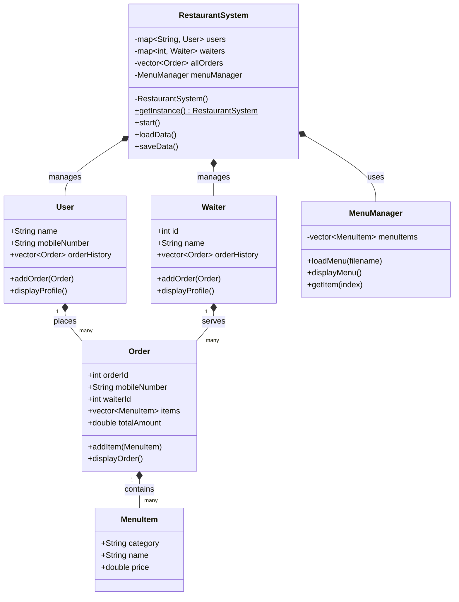
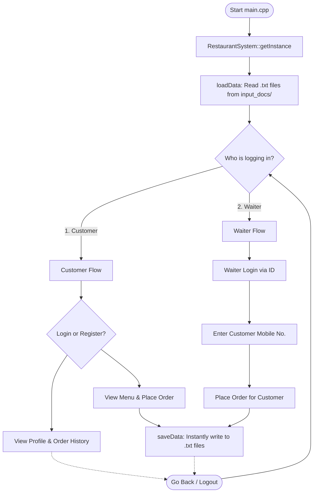

# Restaurant Management System - Low Level Design (LLD)

Welcome! If you are a first-year B.Tech student exploring how real-world C++ projects are designed, this document is for you. We will break down exactly how our Restaurant Management system is built behind the scenes.

## 1. Class Structure (UML Diagram)

In Object-Oriented Programming (OOP), we use "Classes" as blueprints. Here is the UML (Unified Modeling Language) diagram showing the blueprints we used and how they connect to each other:


*(Note: An `Order` comprises multiple `MenuItem` objects, and a `User` holds multiple `Order` objects. The `RestaurantSystem` is the central brain that manages them all).*

---

## 2. Program Flow Chart

How does the data move when you run the black terminal screen? Here is the flow of our program:



---

## 3. Important Technical Concepts Used (Cheat Sheet!)

As a CS student, these are the core topics applied practically in this project:

### A. File Input/Output (File I/O)
When your program closes, RAM is cleared. We use File I/O to save data permanently to the hard drive.
*   **`ifstream`**: Input File Stream (for Reading).
*   **`ofstream`**: Output File Stream (for Writing).

**Code Example from Project:**
```cpp
#include <fstream>
using namespace std;

// ✍️ WRITING a new user to the database
ofstream outFile("input_docs/users.txt");
outFile << "9999999999" << "|" << "John Doe" << "\n";
outFile.close(); // Always close files when done!

// 📖 READING from the database
ifstream inFile("input_docs/users.txt");
string line;
while (getline(inFile, line)) {
    // We read the file line by line here!
}
inFile.close();
```

### B. Data Structures & Algorithms (DSA)
Selecting the right data structure makes the code remarkably fast!
1.  **`std::vector` (Dynamic Arrays):** Unlike older fixed arrays `int arr[10];`, a vector grows automatically. We use `vector<MenuItem>` for Orders because a customer might order 1 item or 100 items. We don't have to guess the size in advance.
2.  **`std::map` (Dictionaries / Trees):** We use a map to store our users: `map<string, User> users;`. Whenever someone logs in, we don't use a slow `for` loop to search through thousands of users. We just look up their mobile number `users["9999999999"]`, and it instantly fetches their profile! Underneath, C++ implements this using an efficient tree structure (Red-Black tree).

### C. Object-Oriented Programming (OOP) Concepts
1.  **Classes & Objects:** A `Class` is the blueprint structure (like our `User` class layout), while an `Object` is the actual entity loaded in memory (like `User John("John", "999")`).
2.  **Encapsulation:** In `RestaurantSystem`, all the data arrays (like the list of all Orders) are marked `private`. This means the outside world inside `main.cpp` cannot accidentally delete orders. Data is protected and encapsulated.
3.  **Singleton Design Pattern:** This is a famous software engineering pattern! It guarantees only **ONE** `RestaurantSystem` object can ever exist. Notice its constructor `RestaurantSystem()` is `private`. To access the system, you must call its static builder method:
```cpp
RestaurantSystem& RestaurantSystem::getInstance() {
    static RestaurantSystem instance; // Only created once in memory!
    return instance; 
}
```